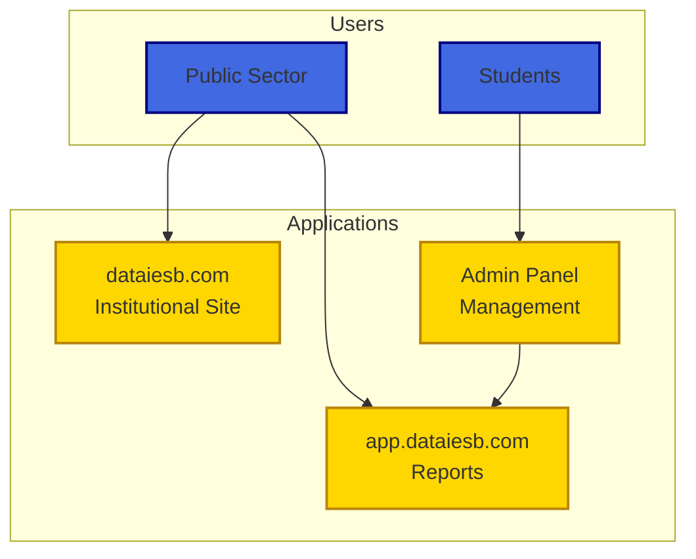
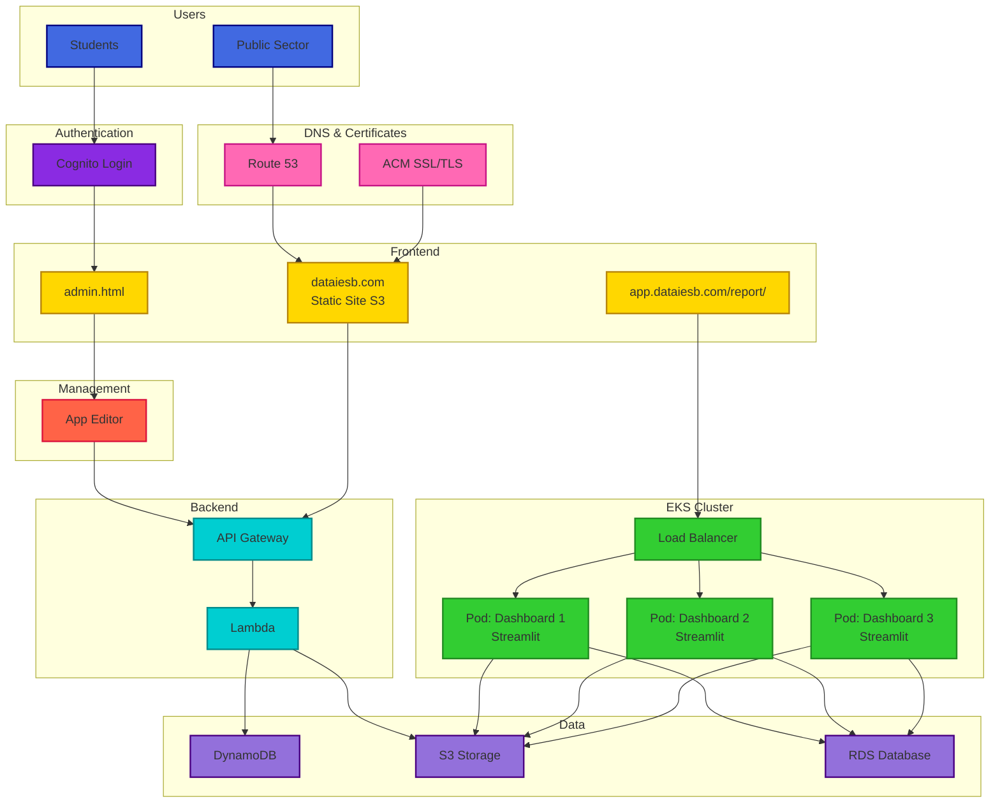
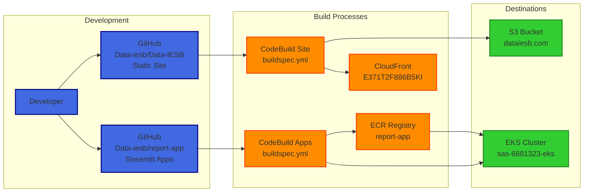

# Big Data IESB Platform

[](https://github.com/Data-iesb/Data-IESB/actions/workflows/deploy-main.yml)

**Author**: Roberto Moreira Diniz  
**GitHub**: [github.com/s33ding](https://www.github.com/s33ding/)  
**LinkedIn**: [linkedin.com/in/s33ding](https://linkedin.com/in/s33ding)

The **Big Data IESB Project** is a strategic initiative focused on creating and maintaining a structured data platform composed of public information and, when applicable, proprietary data from partner organizations. The main objective is to provide a comprehensive analytical foundation that contributes to improved decision-making, increased public management efficiency, evidence-based policy formulation, and higher quality services to the population.

The platform was designed to serve different user profiles, particularly the public sector, civil society organizations, and educational institutions, promoting innovative data-driven solutions focused on efficiency, innovation, and social responsibility. The project covers diverse areas of social and governmental interest, including health, education, environment, public safety, human rights, labor market, public finance, social assistance, housing, and urban development. Through the integration of data from these areas, the project seeks to foster knowledge generation, innovation in public policies, and the formulation of analytical solutions aimed at the common good.

## Platform Access

- **Main Website**: https://dataiesb.com
- **Reports Dashboard**: https://app.dataiesb.com/report/
- **Development Environment**: https://d2v66tm8wx23ar.cloudfront.net

## Related Repositories

- **[report-app](https://github.com/Data-iesb/report-app)** - Streamlit dashboard applications deployed on EKS

## Technology Infrastructure

In the context of technological infrastructure, the system was refactored to a **serverless architecture**, adopting native **Amazon Web Services (AWS)** services. Website storage and hosting were migrated to **Amazon S3**, configured with appropriate permissions via **Access Control List (ACL)** and distributed as a high-availability public site. The domain was acquired and configured through **Amazon Route 53**, with digital certificates issued by **AWS Certificate Manager (ACM)** and accelerated content distribution via **Amazon CloudFront**.

To enable continuous updates and simplify the maintenance process, a continuous integration and delivery pipeline was implemented using **AWS CodeBuild**, allowing different collaborators to modify and update the site content in an automated and secure manner. The backend was developed in **AWS Lambda**, ensuring on-demand scalability and reducing operational costs, while dynamic data storage was structured in **Amazon DynamoDB**, guaranteeing durability, performance, and information integrity.

Authentication and access control were established through **Amazon Cognito**, integrating external identity providers and restricting access to users linked to institutional domains. This approach ensures centralized credential management, reinforcing the security and governance aspects of the application.

Additionally, a custom application was developed in **Streamlit**, deployed on an **Amazon EKS (Elastic Kubernetes Service)** cluster. This application aims to dynamically display academic panels and indicators in a unified and interactive interface. The cluster was configured to support other academic workloads, such as data science experiments and machine learning applications, providing flexibility, performance, and scalability to the computational infrastructure.

## Architecture Overview

### User Access Flow


### AWS Infrastructure


### CI/CD Pipeline


### Infrastructure as Code (IaC)

```mermaid
graph TD
    subgraph "DataIESB IaC"
        TF_MAIN[main.tf<br/>Core Resources]
        TF_VARS[variables.tf<br/>Configuration]
        TF_OUT[outputs.tf<br/>Export Values]
    end
    
    subgraph "report-app IaC"
        IAAC[iaac/<br/>Infrastructure Scripts]
        DDB[dynamodb.sh<br/>DynamoDB Tables]
        PUB[make-public.sh<br/>S3 Public Config]
    end
    
    subgraph "Kubernetes Manifests"
        EKS_DIR[eks/<br/>K8s Manifests]
        DEP[deployment.yaml<br/>App Deployment]
        SVC[service.yaml<br/>Load Balancer]
        SA[eksctl-sa.sh<br/>Service Account]
        POL1[s3-policy-fix.json<br/>S3 Permissions]
        POL2[s3-policy-updated.json<br/>Updated Policies]
    end
    
    subgraph "AWS Resources"
        DYNAMO[DynamoDB<br/>DataIESB-TeamMembers<br/>dataiesb-reports]
        S3_BUCKET[S3 Buckets<br/>dataiesb<br/>dataiesb-reports]
        COGNITO[Cognito<br/>User Pool]
        R53[Route 53<br/>dataiesb.com]
        ACM_CERT[ACM Certificate<br/>SSL/TLS]
        EKS_CLUSTER[EKS Cluster<br/>sas-6881323-eks]
        PODS[Kubernetes Pods<br/>report-app]
        LB[Load Balancer<br/>Service]
    end
    
    TF_MAIN --> DYNAMO
    TF_MAIN --> S3_BUCKET
    TF_MAIN --> COGNITO
    TF_MAIN --> R53
    TF_MAIN --> ACM_CERT
    
    IAAC --> DDB
    IAAC --> PUB
    DDB --> DYNAMO
    PUB --> S3_BUCKET
    
    EKS_DIR --> DEP
    EKS_DIR --> SVC
    EKS_DIR --> SA
    EKS_DIR --> POL1
    EKS_DIR --> POL2
    
    DEP --> PODS
    SVC --> LB
    SA --> PODS
    POL1 --> PODS
    POL2 --> PODS
    PODS --> EKS_CLUSTER
    LB --> EKS_CLUSTER
    
    classDef tfClass fill:#623CE4,stroke:#4B0082,stroke-width:2px
    classDef iacClass fill:#9370DB,stroke:#4B0082,stroke-width:2px
    classDef k8sClass fill:#326CE5,stroke:#1E3A8A,stroke-width:2px
    classDef awsClass fill:#FF9900,stroke:#CC7A00,stroke-width:2px
    
    class TF_MAIN,TF_VARS,TF_OUT tfClass
    class IAAC,DDB,PUB iacClass
    class EKS_DIR,DEP,SVC,SA,POL1,POL2 k8sClass
    class DYNAMO,S3_BUCKET,COGNITO,R53,ACM_CERT,EKS_CLUSTER,PODS,LB awsClass
```


## Platform Consolidation

With the adoption of this architecture, the **Big Data IESB Project** has consolidated itself as a modern, scalable, and economically viable platform. The use of AWS managed services – including S3, Lambda, DynamoDB, CloudFront, Route 53, ACM, Cognito, EKS, and CodeBuild – resulted in a solution with high availability, enhanced security, and low operational cost. 

Beyond its technical relevance, the project also stands out as a space for **applied learning**, where IESB students and researchers have the opportunity to apply Data Science and Artificial Intelligence methodologies in real scenarios, contributing to the social and institutional development of the country.

## Repository Structure

```
Data-IESB/
├── src/                          # Website source files
│   ├── index.html               # Homepage
│   ├── quem-somos.html          # About us page
│   ├── equipe.html              # Team page (dynamic)
│   ├── admin.html               # Administrative interface
│   ├── style/                   # CSS files
│   ├── js/                      # JavaScript files
│   └── img/                     # Images and assets
├── .github/                     # GitHub configuration
│   ├── workflows/               # CI/CD pipelines
│   └── ISSUE_TEMPLATE/          # Issue templates
├── deploy-main.sh              # Production deployment script
├── main-config.json            # Production environment config
└── buildspec.yml               # AWS CodeBuild configuration
```

## Quick Start

### Local Development
```bash
# Clone repository
git clone https://github.com/Data-iesb/Data-IESB.git
cd Data-IESB

# Serve locally
cd src
python -m http.server 8000
# Visit: http://localhost:8000
```

### Deployment
Changes pushed to the `main` branch are automatically deployed to production via GitHub Actions and AWS CodeBuild.

## About IESB

**Centro Universitário IESB** is committed to fostering innovation in education and research. The Big Data IESB Platform represents a significant step toward evidence-based decision making and serves as a practical learning environment where students and researchers can apply Data Science and Artificial Intelligence methodologies to real-world scenarios, contributing to the social and institutional development of Brazil.

---

*This platform is maintained by Centro Universitário IESB for educational, research, and public service purposes.*
